# NSX-T Infrastrcutre - Part 1
[Home Page](https://github.com/roie9876/NSXT-VMworld2019)

This guide outlines the configuration steps needed to implement a basic logical network topology. The assumption is vCenter, ESX Hosts and NSX-T Manager has already been deployed.
I forked this guide from amazing works done by Dumlu Timuralp and Hakan Akkurt all the credits belong to them !!!!

# Table Of Contents

[Topology Information](#Topology-Information)       
[Fabric Preperation](#Fabric-Preperation)  
[Host Transport Node](#Host-Transport-Node)   
[Edge Transport Node](#Edge-Transport-Node)   
[Edge Cluster](#Edge-Cluster)  
[Tier 0 Logical Router](#Tier-0-Logical-Router)    
[Tier 1 Logical Router](#Tier-1-Logical-Router)  
[Tier 0 BGP Configuration](#Tier-0-BGP-Configuration)  
[K8S Node Dataplane Connectivity](#K8S-Node-Dataplane-Connectivity)  

# Topology Information
[Back to Table of Contents](#Table-Of-Contents)

* Below logical topology will be implemented in this guide.
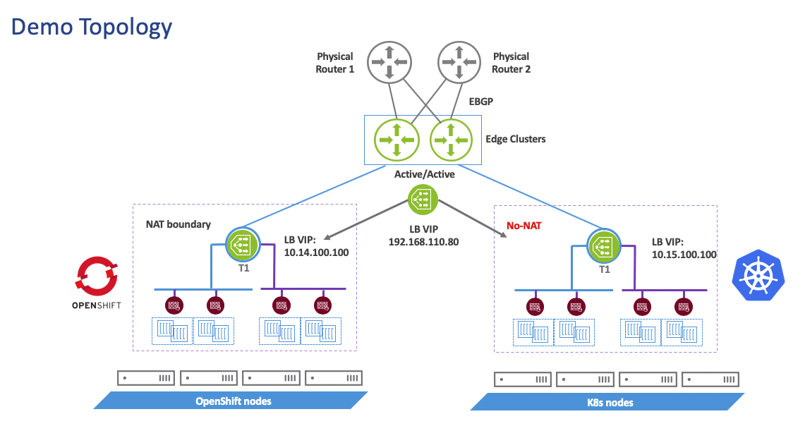

NSX-T Data Center 2.5 can works with tow types of API when it come to container integrations:   

_**Manager API:**_  
In this the NSX-T constructs are configured from "Advanced Networking & Security" menu.
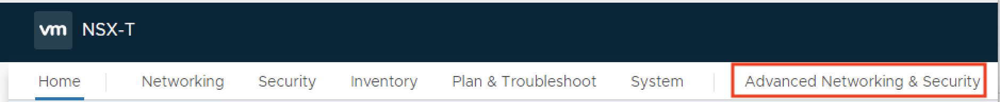

_**Policy API:**_  
With Policy API the NSX-T constructs are configured from  the Network and Security Tab in the UI, also known as Simplified UI
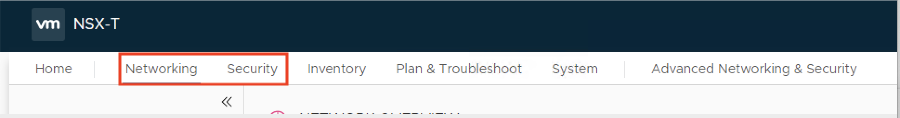

_**In this guide we will work with the Policy API**_

# Fabric Preperation  
[Back to Table of Contents](#Table-Of-Contents)

## Compute Manager

vCenter is configured as a "Compute Manager" on NSX-T Manager (_**System -> Fabric -> Compute Managers**_)

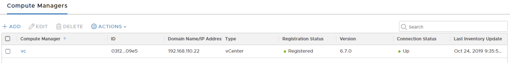

This helps for easier ESX cluster management since NSX-T automatically pulls the cluster information from the vCenter. When a new ESX Host is added to the cluster, it will automatically appear on "Host Transport Nodes" list in NSX GUI.  

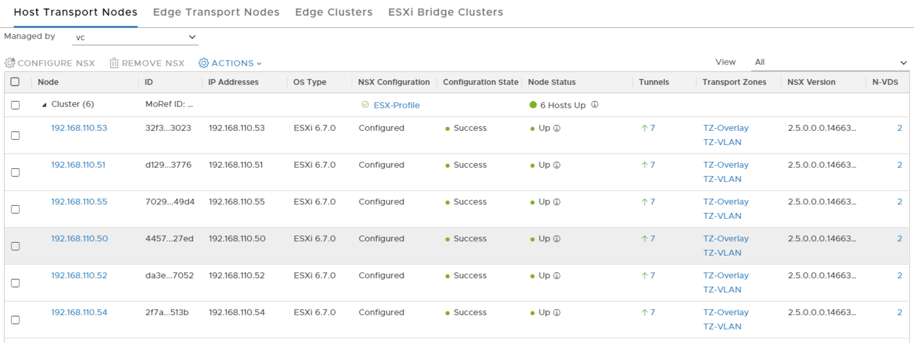

ESX Host preparation process can also be automated for the the ESX Hosts by configuring "Transport Node Profiles" in Fabric -> Profiles menu.

_**Note: Compute manager feature is not for inventory collection (VM, containers etc.) from ESX Hosts. It is for ESX cluster and ESX Host visibility. NSX-T Manager collects the inventory directly from the ESX/KVM Host Transport Nodes.**_

## Transport Zone

Tow transport zones are configured. (_**System -> Fabric -> Transport Zones**_)

Host Transport Node is attached to "TZ-VLAN" and "TZ-Overlay" transport zones.

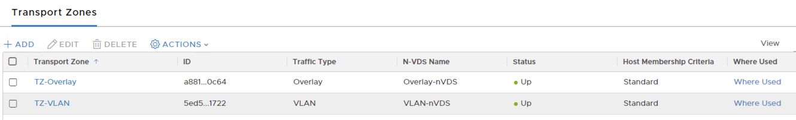

Notice that both "TZ-VLAN" and "TZ-Overlay" transport zones have the exact diffrent _**N-VDS NAME**_ specified. each N-VDS is an individual virtual switch, if a different N-VDS name is used for each transport zone then multiple N-VDSs has to be instantiated on the same Host Tranport node which will consume more physical ports on the same ESX Host for resiliency. Because the same vmnic/pnic _**CANNOT**_ be attached to two different virtual switches.

## VTEP Pool

"VTEP" stands for the "Virtual Tunnel EndPoint" on an Edge Transport Node or Host Transport Node. It is the virtual interface which encapsulates the traffic, from the VMs or K8S Pods, with a GENEVE header and then sends towards the destination through the physical network. Each transport node picks an available IP from the VTEP Pool to be assigned to its VTEP interface. This VTEP pool will be referenced later on in the NSX host/edge preperation steps. (On ESX Host this interface is instantiated as a vmkernel interface.)

_**Advanced Networking & Security -> Inventory -> Groups -> Ip Pools**_

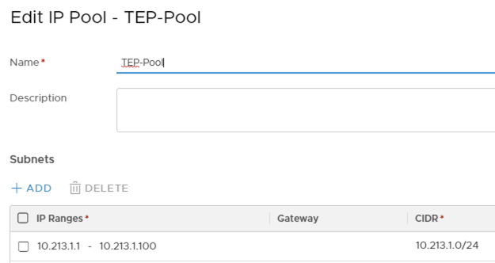

## Uplink Profile

Two uplink profiles are used.  

### Edge Uplink Profile
 _**System ->  Fabric -> Profiles -> Uplink Profiles**_  

The names "uplink1" in the "Edge-Uplink-Profile" are just user defined names. They can be "vmware1" as well.  The same names mst be used when preparing the transport node with the respective uplink profile. This is another abstraction that NSX-T has for easier automation.  
The VLAN ID 0 is beucase the VTEP interface of the Edge Transport Node will _**NOT**_ be tagging the overlay traffic. It will be sending the overlay traffic untagged to the underlying "vSphere Standard Switch (vSS)" on the ESX Host. The respective port group on "vSS"  will be tagging the overlay traffic with the appropriate VLAN ID onwards to the physical network.we planing to connect the edge with vDS/vSS portgroup and define tag there.  

_**Avoid tag twise inside NSX-T profile and then on the vDS/vSS.**_  

here is the screnshots for the edge-uplink-profile:

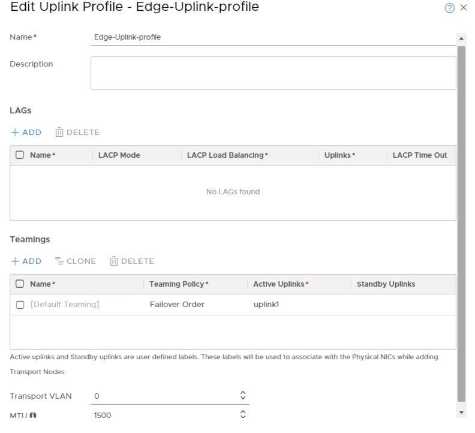 

### ESX Uplink Profile 
This is the place we define the ESX profile for the Transport Node.
  
 (_**System ->  Fabric -> Profiles -> Transport Node Profiles**_)  
 

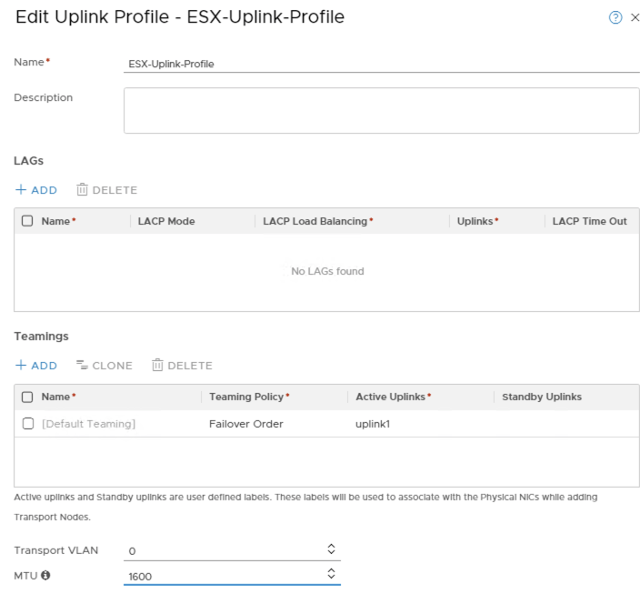

# Trnasport Node Proflie
here bind the ESXi  uplink profile to the Trnasport Node Profile:

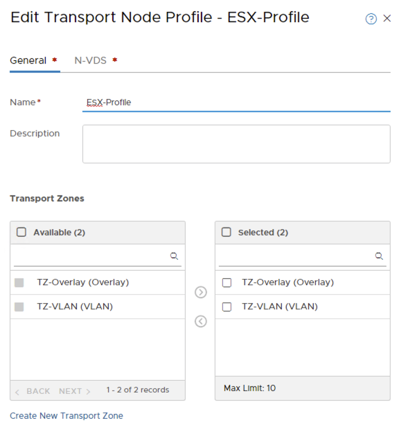

The esxi uplink profile and TEP IP pool associations for this ESX Host is shown below.
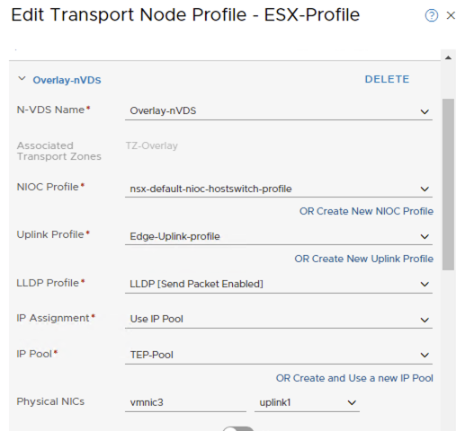

[Back to Table of Contents](#Table-Of-Contents)

**Note** : If desired, all the connectivity of the ESX Host can be collapsed onto N-VDS (by migrating ESX management/vMotion vmkernels to the N-VDS) , in this environment it is preferred to use a vSS and an N-VDS on the ESX Host.

# Edge Transport Node
[Back to Table of Contents](#Table-Of-Contents)

Two Edge Transport Node VMs are configured in this environment. (_**System -> Fabric -> Nodes- > Edge Transport Nodes**_)

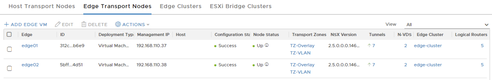  

As mentioned earlier Edge Transport Nodes are attached to "TZ-VLAN" and "TZ-Overlay". Essentially, this means that two different N-VDS will be instantiated on the Edge Transport Node.

* Edge Transport Node#1 and Edge Transport Node#2 are both deployed on the same Cluster as the NSX Managers.

* Management interface is the eth0/vNIC1 of the EdgeNode and it is a dedicated interface with its own routing information base (aka VRF) .  In this environment 192.168.110.37 and .38 /24 is used as EdgeNode management interface IPs.

* Below screenshot shows how the vNIC of the Edge Node shows up in vCenter GUI. Notice that vNIC4 is also connected to EdgeTEP port group on vSS, however in this environment vNIC is NOT used by the Edge at all (based on the configuration we implemented) , however during deployment NSX-T automatically connects vNIC2 and vNIC4 to the same port group on the underlying vSS.

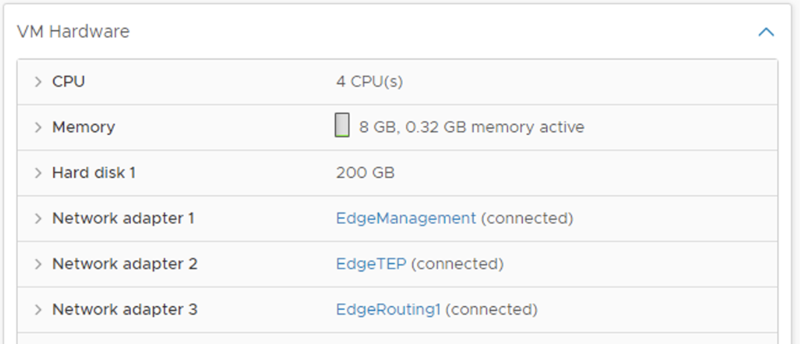

# Edge Cluster
[Back to Table of Contents](#Table-Of-Contents)

To provide resiliency for the centralized services (Tier 0 Services Router - SR Component) that will be configured later on, an Edge Cluster is provisioned. (_**System -> Fabric -> Nodes -> Edge Clusters**_)

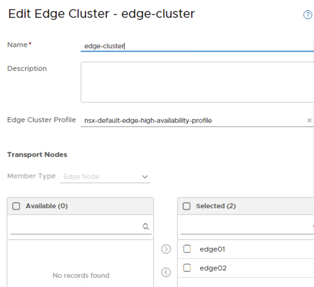

# Tier 0 Logical Gateway
[Back to Table of Contents](#Table-Of-Contents)

### Create Logical Segment for Tier 0 Logical Gateway Uplink Interface
(_**Networking -> Segments -> SEGMENTS**_)

To attach Tier 0 Logical Gateway to the physical network, a VLAN logical segment is needed. It is configured as "tier0-uplink", shown below. Notice the VLAN ID : 0 , this means this logical switch will NOT tag traffic. As mentioned earlier, all traffic is being tagged by the underlying vSS on the ESX Host (which the Edge Transport Node is running on)

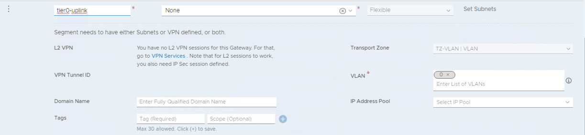

### Create Tier 0 Logical Router
(_**Networking ->  Tier-0 Gateways -> Add -> Tier-0 Gateway**_)

A new Tier 0 Logical Gateway named as "tier0" is provisioned. Tier 0 Logical Gateway always has an SR (Services Router) component. When provisioning Tier 0 Logical Gateway, an Edge Cluster has to be selected to instantiate the SR component. HA Mode has been selected as Active-Active. 

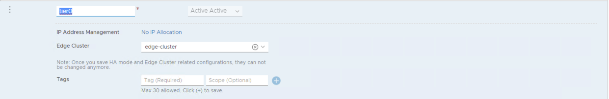

### Tier 0 Logical Gateway Uplink Interface Configuration
(_**networking > Tier0 Gateways -> Eedit tier0 -> INTERFACES**_)

We need to assigen IP address to the tier0-uplink interface. 

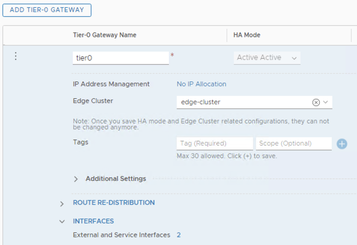  

Click on the Set Interfaces and "ADD INTERFACE" , we need to create tow interfaces, for both tier0's. the new tow interfaces will connect to the same Segment we just created before "tier0-uplink", we could sepreate them to diffrent segment but for simplicity i'm using the same segment.
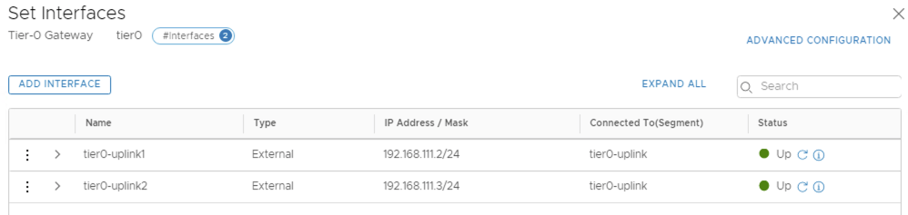

# Tier 0 BGP Configuration
[Back to Table of Contents](#Table-Of-Contents)

* BGP neighborship : (_**Networking -> tier0 Gateways -> "tier0"-> BGP**_)

At this point Tier 0 run in Active/Active mode. We need to configured with BGP to dynamically announce the prefixes in the NSX domain to the physical network. Below are the BGP parameters used. Notice that "Local Address" is set to "All Uplinks" . This setting effectively enables BGP neighborship initiation on both Tier 0 Active and Tier 0 Active uplink interfaces.

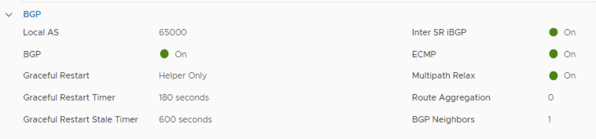

* Route Redistribution to BGP : (_**Networking -> Tier0 Gateways -> "tier0" ->  Route Redistribution**_)
At a minimum Tier0 Connected interfaces, Tier 1 NAT, Tier 1 Connected Interfaces and Tier 1 LB LB SNAT IP and LB VIP prefixes should be redistributed to BGP. This will be explained in upcoming chapters. but just to quickly touch on it.

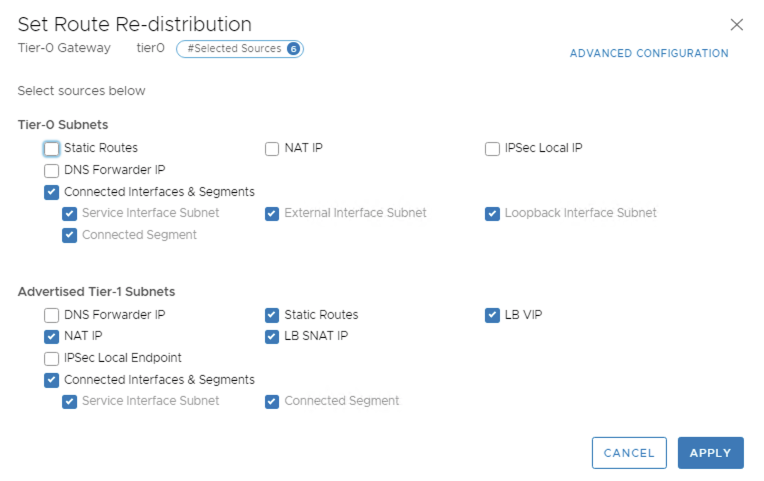

# Tier 1 Logical Router
[Back to Table of Contents](#Table-Of-Contents)

for simplicty i will discribe the tier1 Gateway and Segments for the native K8s cluster, but the samce concept aplly for the OpenShift.
### Creating a Tier 1 Logical Router
(_**Networking -> Tier01 Gateways-> Add -> Tier-1 Gateway**_)

In this Lab we create two Tier1 Gateways, one for the management of the OpenShift Cluster and the Second is for the managment of the K8s cluster.
A new Tier 1 Logical Gateway named as "k8s-mgmt" and "openshift-mgmt".  is provisioned and an Edge Cluster is NOT selected. Tier 1 Logical Router will not use an SR component. SR component is not mandatory for Tier 1; it is needed only when any centralized services (eg FW, NAT, LB) is used in Tier 1 Logical Router. In this environment, only the distributed routing feature will be used with this Tier 1 Logical Router. Tier 1's DR (Distributed Router) component will be connected to the Tier 0 which is provisioned earlier.

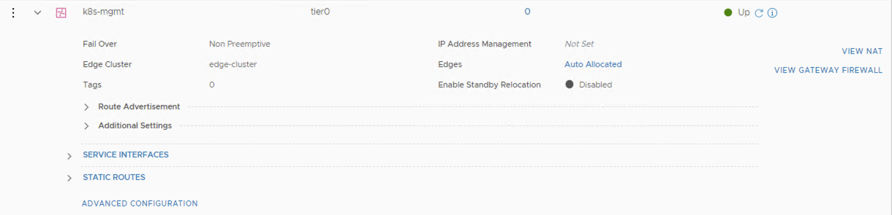

### Create a Logical Segment for K8S Node VM and OpenShift Management Connectivity
(_**Networking  -> Seegments**_)

Each K8S/OpenShift Node is a VM.  
The screnshot bellow is from the vCenter, as you can we have resouce pool for the OpenShift Cluster and resoudce pool for the Native K8s cluster.

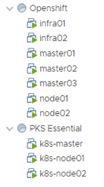  

All Nodes VM will have two Ethernet interfaces.   
For the K8s masters/workers. the first interface using for management. the second interface is using for PODs dataplane.

# K8S Node Management Connectivity
[Back to Table of Contents](#Table-Of-Contents)

* Create a Logical Segment for K8S Node VM Management Connectivity : (_**Networking  -> Segments -> SEGMENT**_)

A new _**overlay**_ logical segment, named as ****"K8s-managment"** is provisioned. Each K8S Node VM' s vNIC1 (ens160) will be connected to this logical switch/segment. K8S Master Node and Worker Nodes will be communicating with each other through this logical switch/segment. K8S Nodes will also check the liveness/readiness of the K8S PODs through this network/ens160(vNIC1)

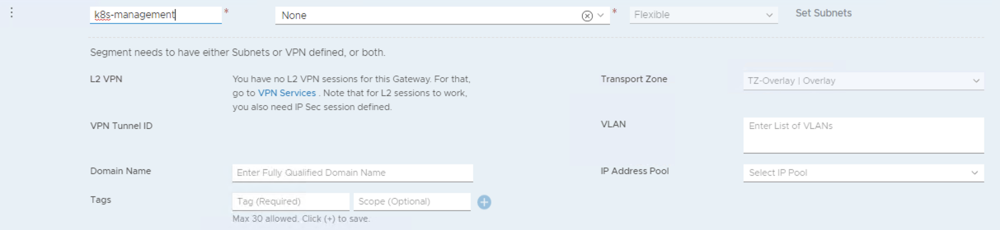

# K8S Node Dataplane Connectivity
[Back to Table of Contents](#Table-Of-Contents)

* Create a Logical Segment for K8S Node VM Dataplane Connectivity : (_**Networking  -> Segments -> SEGMENT**_)

* A seperate logical switch/segment will be used to connect the second vNIC (ens192) of each K8S Node VM. vNIC2 and this logical switch will be providing the transport medium for the K8S Pods (**NOT** nodes) to communicate with the infrastructure. This logical segment is named as **"k8s-container"** in this environment.

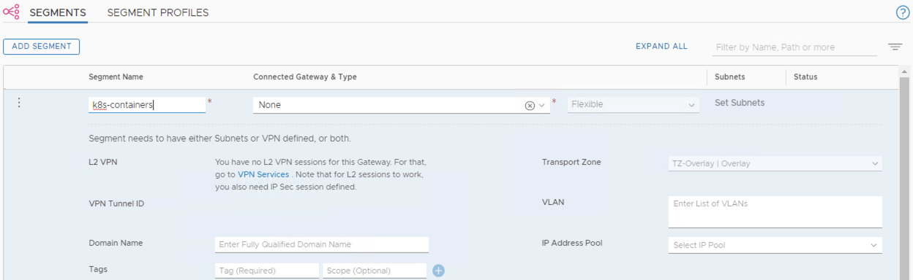

This logical switch/segment will **NOT** be connected to any Tier 0 or Tier 1 Logical Router. It will solely serve for the purpose of providing the transport for K8S Pods. This will be explained in the upcoming chapters.

In the vCenter we need to connect this two logical segments, The first segment interface is called k8s-managment, inside the ubuntu its called ens160 (vNIC1).  
The second interface is called k8s1-containers, inisde the ubuntu its interface ens192 (vNIC2):

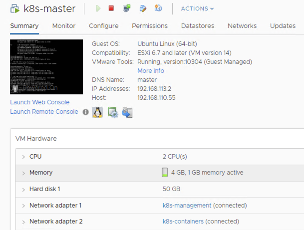

### Tier 1 Service Interfaces  Configuration
(_**Networking  -> Tier1 Gateway -> "Service Interfaces" Add**_)

A new Service Interfaces is provisioned on the Tier 1 Logical Router. This interface is connected to the overlay logical switch/segment provisioned in the previous step. (Logical Switch : "k8s-management")

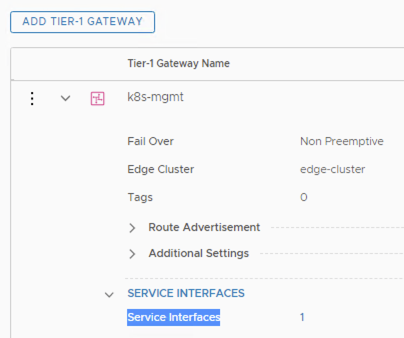

We need to provid IP address for this manement interface.  

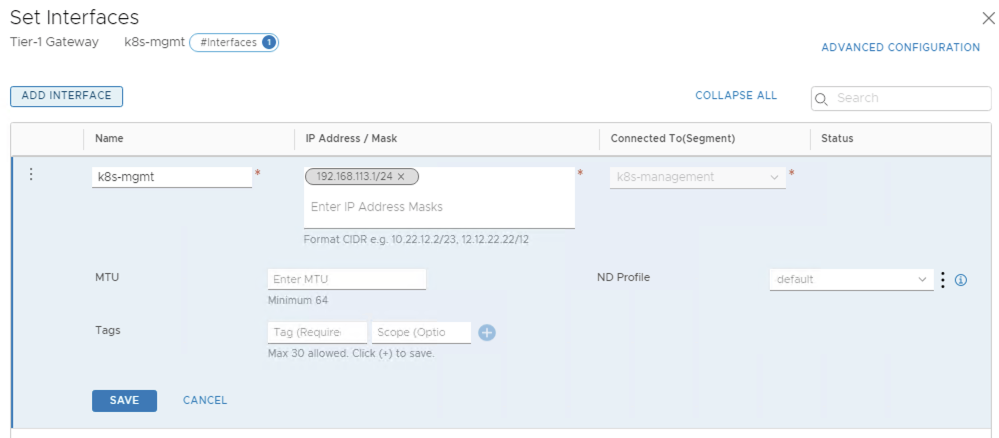

### Route Advertisement on Tier 1 Logical Gateway
(_**Networking -> Tier0-Gateway -> "tier0" -> Routing -> Route Advertisement**_)

Tier 0 logical router does _**NOT**_ magically get the Tier 1 Logical Router' s downlink interface' s subnet prefix. For this, "Route Advertisement" on Tier 1 should be properly configured. As shown below.

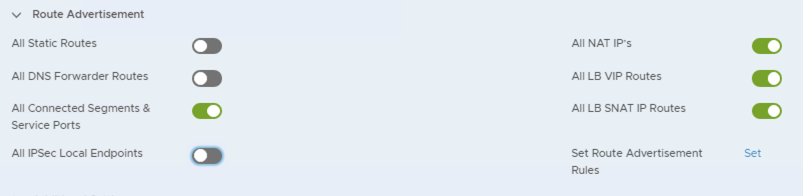

At this point Tier 0' s routing table should see  Tier 1's downlink interface prefix on its routing table. To check that, the user can SSH to the Edge Transport Node' s management IP address (192.168.110.37 in this case. You can check this by looking at Tier 0' s information tab in NSX GUI.) Once SSHed to Edge Transport Node, then in the CLI, perform "get logical-routers" command, and then perform "vrf <Tier 0 SR' s VRF ID> ", then "get route". The output should have a route with a next hop pointing to Tier 1' s uplink IP.

[Back to Table of Contents](#Table-Of-Contents)

This concludes Part 1. We will look into the details of which other NSX-T objects will be integrated with K8S and also prepare a K8S cluster in Part 2.

### [Part 2](https://github.com/roie9876/NSXT-VMworld2019/tree/master/Part%202)
