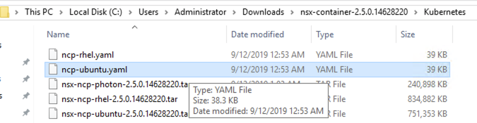
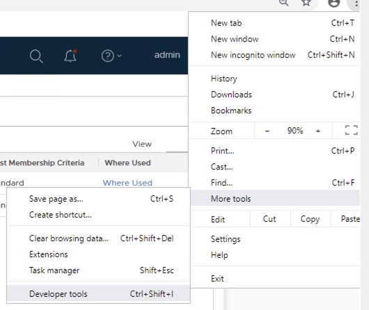
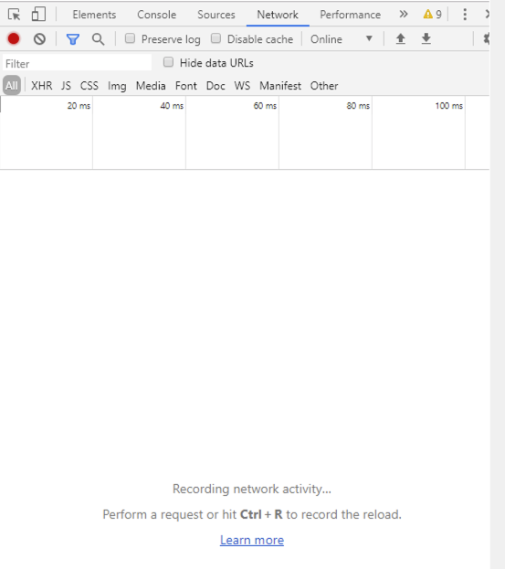
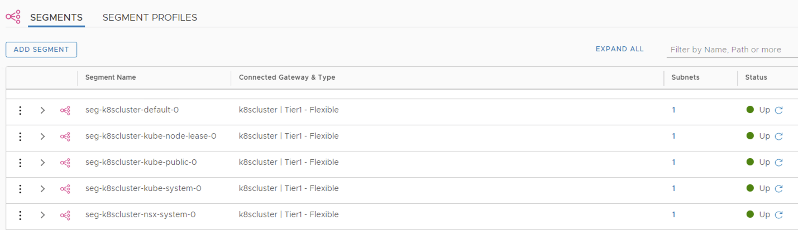
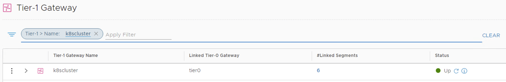
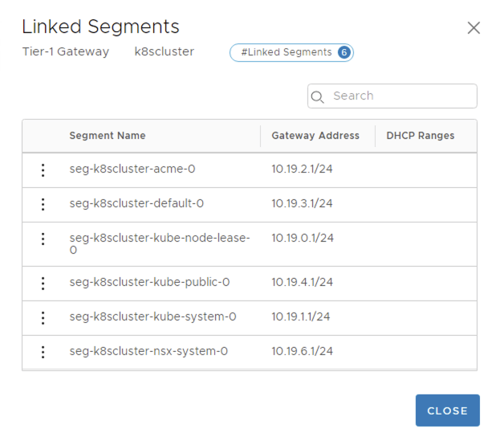
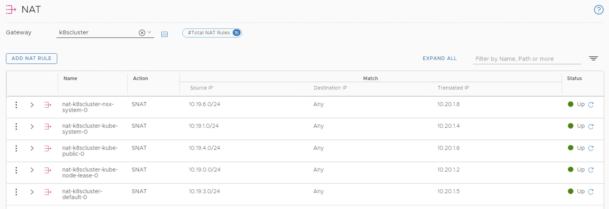
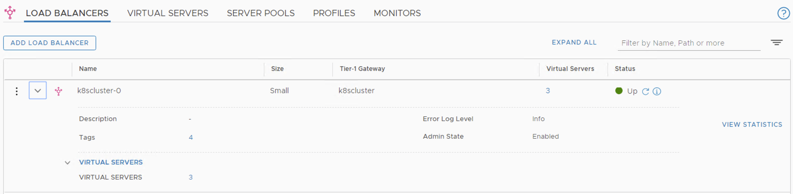
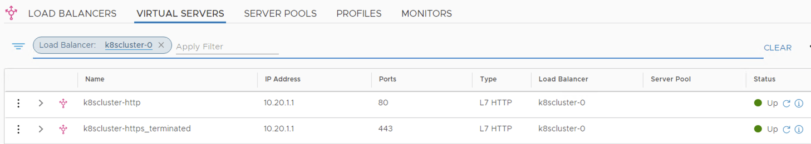
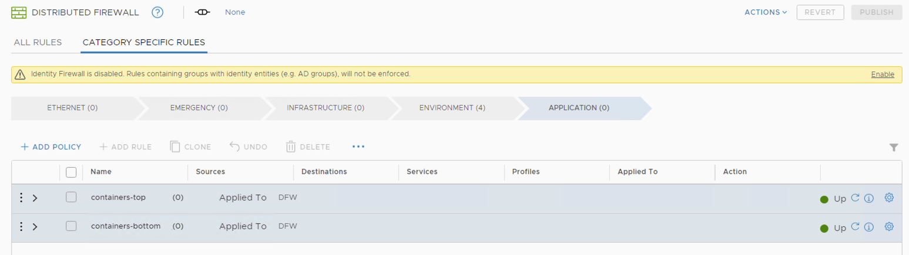

# NSX-T & K8S - PART 4
[Home Page](https://github.com/dumlutimuralp/nsx-t-k8s)

# Table Of Contents

[Current State](#Current-State)   
[NSX Container Plugin (NCP) Installation](#NSX-Container-Plugin-Installation)  
[NSX Node Agent Installation](#NSX-Node-Agent-Installation)  
[Test Workload Deployment](#Test-Workload-Deployment)

# Current State before install and configure the NCP
[Back to Table of Contents](#Table-Of-Contents)

## K8S Cluster

Previously in Part 3, K8S cluster has successfully been formed using kubeadm. 

<pre><code>
root@master:/home/localadmin# kubectl get node
NAME     STATUS   ROLES    AGE     VERSION
master   Ready    master   2d22h   v1.14.2
node01   Ready          <none>   2d22h   v1.14.2
node02   Ready          <none>   2d18h   v1.14.2

</code></pre>

The namespaces that are provisioned by default can be seen using the following kubectl command.

<pre><code>
root@master:/home/localadmin# kubectl get ns
NAME              STATUS   AGE
default           Active   2d22h
kube-node-lease   Active   2d22h
kube-public       Active   2d22h
kube-system       Active   2d22h
root@master:/home/localadmin#

</code></pre>

To see which infrastructure Pods are automatically provisioned during the initialization of K8S cluster, following command can be used.

<pre><code>
root@master:/home/localadmin# kubectl get pods --all-namespaces
NAMESPACE     NAME                             READY   STATUS              RESTARTS   AGE
kube-system   coredns-584795fc57-hwxrv         0/1     ContainerCreating   0          31s
kube-system   coredns-584795fc57-zpjh6         0/1     ContainerCreating   0          6s
kube-system   etcd-master                      1/1     Running             0          2d22h
kube-system   kube-apiserver-master            1/1     Running             0          2d22h
kube-system   kube-controller-manager-master   1/1     Running             0          2d22h
kube-system   kube-proxy-9bvvf                 1/1     Running             1          2d18h
kube-system   kube-proxy-9vhcf                 1/1     Running             1          2d22h
kube-system   kube-proxy-xpkhk                 1/1     Running             0          2d22h
kube-system   kube-scheduler-master            1/1     Running             0          2d22h

</code></pre>

_**Notice "coredns-xxx" Pods are stuck in "ContainerCreating" phase, the reason is although kubelet agent on K8S worker Node sent a request to NSX-T CNI Plugin module to start provisioning the individual network interface for these Pods, since the NSX Node Agent is not installed on the K8S worker nodes yet (Nor the NSX Container Plugin for attaching NSX-T management plane to K8S API) , kubelet can not move forward with the Pod creation.**_

We can learnd it from the description of the coredns pod:  

<pre><code>
root@master:/home/localadmin# kubectl describe pod coredns-584795fc57-hwxrv  -n kube-system
Name:               coredns-584795fc57-hwxrv
Namespace:          kube-system
Priority:           2000000000
PriorityClassName:  system-cluster-critical
Node:               node02/192.168.110.73
Start Time:         Fri, 25 Oct 2019 11:22:00 +0300
Labels:             k8s-app=kube-dns
                    pod-template-hash=584795fc57
Annotations:        <none>
Status:             Pending
IP:
Controlled By:      ReplicaSet/coredns-584795fc57
Containers:
  coredns:
    Container ID:
    Image:         k8s.gcr.io/coredns:1.3.1
    Image ID:
    Ports:         53/UDP, 53/TCP, 9153/TCP
    Host Ports:    0/UDP, 0/TCP, 0/TCP
    Args:
      -conf
      /etc/coredns/Corefile
    State:          Waiting
      Reason:       ContainerCreating
    Ready:          False
    Restart Count:  0
    Limits:
      memory:  170Mi
    Requests:
      cpu:        100m
      memory:     70Mi
    Liveness:     http-get http://:8080/health delay=60s timeout=5s period=10s #success=1 #failure=5
    Readiness:    http-get http://:8080/health delay=0s timeout=1s period=10s #success=1 #failure=3
    Environment:  <none>
    Mounts:
      /etc/coredns from config-volume (ro)
      /var/run/secrets/kubernetes.io/serviceaccount from coredns-token-8xg74 (ro)
Conditions:
  Type              Status
  Initialized       True
  Ready             False
  ContainersReady   False
  PodScheduled      True
Volumes:
  config-volume:
    Type:      ConfigMap (a volume populated by a ConfigMap)
    Name:      coredns
    Optional:  false
  coredns-token-8xg74:
    Type:        Secret (a volume populated by a Secret)
    SecretName:  coredns-token-8xg74
    Optional:    false
QoS Class:       Burstable
Node-Selectors:  beta.kubernetes.io/os=linux
Tolerations:     CriticalAddonsOnly
                 node-role.kubernetes.io/master:NoSchedule
                 node.kubernetes.io/not-ready:NoExecute for 300s
                 node.kubernetes.io/unreachable:NoExecute for 300s
Events:
  Type     Reason                  Age               From               Message
  ----     ------                  ----              ----               -------
  Normal   Scheduled               45s               default-scheduler  Successfully assigned kube-system/coredns-584795fc57-hwxrv to node02
  Warning  FailedCreatePodSandBox  44s               kubelet, node02    Failed create pod sandbox: rpc error: code = Unknown desc = [failed to set up sandbox container "8958bc4b62fa3292d8209e423b34d49d78fa9749b153db733b7ffcd30bae3ac2" network for pod "coredns-584795fc57-hwxrv": NetworkPlugin cni failed to set up pod "coredns-584795fc57-hwxrv_kube-system" network: Failed to connect to nsx_node_agent: [Errno 111] Connection refused, failed to clean up sandbox container "8958bc4b62fa3292d8209e423b34d49d78fa9749b153db733b7ffcd30bae3ac2" network for pod "coredns-584795fc57-hwxrv": NetworkPlugin cni failed to teardown pod "coredns-584795fc57-hwxrv_kube-system" network: Failed to connect to nsx_node_agent: [Errno 111] Connection refused]
  Normal   SandboxChanged          2s (x4 over 44s)  kubelet, node02    Pod sandbox changed, it will be killed and re-created.
</code></pre>

# NSX Container Plugin Installation
[Back to Table of Contents](#Table-Of-Contents)

Once again, NSX Container Plugin (NCP) image file is in the NSX container folder that was copied to each K8S node will be used in this section. 

## Load The Docker Image for NSX NCP (and NSX Node Agent) on K8S Nodes

For the commands below, "sudo" can be used with each command or privilege can be escalated to root by using "sudo -H bash" in advance.

On each K8S node, navigate to "/home/vmware/nsx-container-2.4.1.13515827/Kubernetes" folder then execute the following command to load respective image to the local Docker repository of each K8S Node. 

_**NSX Container Plugin (NCP) and NSX Node Agent Pods use the same container image.**_

## Install NCP image on all masters and Workers 

CNI is a Cloud Native Computing Foundation (CNCF) project. It is a set of specifications and libraries to configure network interfaces in Linux containers. It has a pluggable architecture hence third party plugins are supported.

NSX-T CNI Plugin comes within the "NSX-T Container" package. The package can be downloaded (in _.zip_ format) from Downloads page for NSX-T, shown below.

In the current NSX-T version (2.5.0) , the zip file is named as "**nsx-container-2.5.0.14628220**" . 

* Extract the zip file to a folder. 

* Use SCP/SSH to copy the folder to the Ubuntu node. Winscp is used as the SCP tool on Windows client and the folder is copied to /home/vmware location on Ubuntu node.

* **For all the installation steps mentioned below and following sections in this guide root level access will be used.**

* Escalate to root in the shell

<pre><code>
vmware@k8s-master:~$ <b>sudo -H bash</b>
[sudo] password for vmware:
root@k8s-master:/home/vmware#
</code></pre>

* On the Ubuntu shell, navigate to "/home/vmware/nsx-container-2.5.0.14628220/Kubernetes/" folder, and then install NCP image shown below.

<pre><code>
root@k8s-master:/home/vmware/nsx-container-2.5.0.14628220/Kubernetes/# 
<b>docker load  -i nsx-ncp-ubuntu-2.5.0.14628220.tar</b>
Loaded image: registry.local/2.5.0.14628220/nsx-ncp-ubuntu:latest
</code></pre>

then we need to tag the ncp image as nsx-ncp:
<pre><code>
docker tag registry.local/2.5.0.14628220/nsx-ncp-ubuntu:latest nsx-ncp
</code></pre>

<pre><code>
root@k8s-master:/home/vmware/nsx-container-2.5.0.14628220/Kubernetes# <b> docker tag registry.local/2.5.0.14628220/nsx-ncp-ubuntu:latest nsx-ncp:latest</b>
root@k8s-master:/home/vmware/nsx-container-2.5.0.14628220/Kubernetes#
</code></pre>

Verify the image name has changed. 

<pre><code>
root@master:/home/localadmin# docker images
REPOSITORY                                                         TAG                 IMAGE ID            CREATED             SIZE
k8s.gcr.io/kube-apiserver                                          v1.14.8             1e94481e8f30        9 days ago          209MB
k8s.gcr.io/kube-proxy                                              v1.14.8             849af609e0c6        9 days ago          82.1MB
k8s.gcr.io/kube-controller-manager                                 v1.14.8             36a8001a79fd        9 days ago          158MB
k8s.gcr.io/kube-scheduler                                          v1.14.8             f1e3e5f9f93e        9 days ago          81.6MB
registry.local/2.5.0.14628220/nsx-ncp-ubuntu                       latest              40aae9a4aeda        6 weeks ago         744MB
nsx-ncp                                                            latest              40aae9a4aeda        6 weeks ago         744MB
284299419820.dkr.ecr.us-west-2.amazonaws.com/ws-client             v1.0.0              d87c306ddd38        6 weeks ago         79.9MB
284299419820.dkr.ecr.us-west-2.amazonaws.com/k8s-cluster-manager   v0.7.3              c9225cfd6d91        6 weeks ago         148MB
k8s.gcr.io/coredns                                                 1.3.1               eb516548c180        9 months ago        40.3MB
k8s.gcr.io/etcd                                                    3.3.10              2c4adeb21b4f        10 months ago       258MB
tiswanso/install-cni                                               v0.1-dev            84a707a64677        11 months ago       42.8MB
k8s.gcr.io/pause                                                   3.1                 da86e6ba6ca1        22 months ago       742kB

</code></pre>

## Confiure the NCP for K8s Cluster 

In NCP version 2.5 the process of installation and configuration of the NCP improved a lots by automated the all proecess.
The only things that we need to do is configure one yaml file name ncp-ubuntu.yaml. we can find this file in the folder of the NCP installation. 

example of thee original file (before we modiey it) can be found in this link:
[here](https://github.com/roie9876/NSXT-VMworld2019/blob/master/Part%204/ncp-ubuntu.yaml)

We now start to explain the diffrent filed of this file

##  (NCP) Configuration 

The file, "ncp-ubuntu.yml" will be used to deploy NSX Container Plugin. Node-Agent, Kube-Proxy , OVS and other related NCP configurations. 
However, before moving forward, NSX-T specific environmental parameters need to be configured. The yml file contains a configmap for the configuration of the ncp.ini file for the NCP.  Basically most of the parameters are commented out with a "#" character. The definitions of each parameter are in the yml file itself. 

The "ncp-ubuntu.yml" file can simply be edited with a text editor. The parameters in the file that are used in this environment has "#" removed. Below is a list and explanation of each :

staring with NCP 2.5 we can work with the policy API. with Policy API we need to defined the UUIDs of the objects.
#### Note: The UUIDs of the policy API are diffrents then the UUIDs of the manager API.

### how we can find the Policy UUID ? 
With Chrome browser we need to open Developr Tools:  
 

Click on the Ctrl + R to start record:  

  

We can clear the screnn by the small icon   
for example lets find the UUID of the K8s-LB-Pool: 
We need to click on the NSX-T object that we would like to find his UUID:  

There is small blue cirule refress button:   , Click on it and on the right new date will show up. as you can see in the image bellow  
the **"id" : "k8s-LB-Poo"** this is the object UUID.  
  
    
    

now lets start to expalind the diffrent paramters:

**policy_nsxapi = True** : User to specify that NCP will work with the Policy API.  

**single_tier_topology = True** : configure single tier1 per K8s/OpenShift Cluster. starting with NCP 2.5 we have two options for the tier1. we can manualuy create this tier1 and specify his name in the ncp config file, or we can let ncp automaticly create this tier1. in this demo we want ncp to create this tier1 gateway. the name of tier1 taken from the **cluster =** paramters, in ouur demo its k8scluster.

**cluster = k8scluster** : Used to identify the NSX-T objects that are provisioned for this K8S cluster. Notice that K8S Node logical ports in "K8s-Contaainers" are configured with the "k8scluster" tag and the "ncp/cluster" scope also with the hostname of Ubuntu node as the tag and "ncp/node_name" scope on NSX-T side.

**enable_snat = True** : This parameter basically defines that all the K8S Pods in each K8S namespace in this K8S cluster will be SNATed (to be able to access the other resources in the datacenter external to NSX domain) . The SNAT rules will be autoatically provisioned on Tier 0 Router in this lab. The SNAT IP will be allocated from IP Pool named "K8S-NAT-Pool" that was configured back in Part 3.

**apiserver_host_port = 6443** : These parameters are for NCP to access K8S API. **Note this parnter need to configured multiple times in this yaml file, so every time you this parmter you need to configure the same value**
  
**apiserver_host_ip = 192.168.113.2**  
This is the IP address of the master node, if we have clusters of k8s masters we nede to have LB with VIP address.  
**Note this paramter need to configured multiple times in this yaml file, so every time you this parmter you need to configure the same value**

**ingress_mode = nat** : This parameter basically defines that NSX will use SNAT/DNAT rules for K8S ingress (L7 HTTPS/HTTP load balancing) to access the K8S service at the backend.

**nsx_api_managers = 192.168.110.34,192.168.110.35,192.168.110.36** , **nsx_api_user = admin** ,  **nsx_api_password = VMware1!VMware1!**  : These parameters are for NCP to access/consume the NSX Manager. in my lab i have 3 NSX managers, we need to provide the IPs of all managers (not the VIP of the managers). we can work with static username and passowrd (clear text) or we can work with certificate. in this demo i'm working with username and password.

**insecure = True** : NSX Manager server certificate is not verified. in lab enviroment where the NSX manager is self sigeded its better to use this way.

**ttier0_gateway = tier0** : The UUID of the Logical Gateway that will be used for connection top the phisical router (tier0).

**overlay_tz = a8811e7a-4d09-4076-94b3-7a9082750c64** : The UUID of the existing overlay transport zone that will be used for creating new logical switches/segments for K8S namespaces and container networking.

**subnet_prefix = 24** : The size of the IP Pools for the namespaces that will be carved out from the main "K8S-POD-IP-BLOCK" configured in Part 3 (10.19.0.0 /16). Whenever a new K8S namespace is created a /24 IP pool will be allocated from thatthat IP block.

**use_native_loadbalancer = True** : This setting is to use NSX-T load balancer for K8S Service Type : Load Balancer. Whenever a new K8S service is exposed with the Type : Load Balancer then a VIP will be provisioned on NSX-T LB attached to a Tier 1 Logical Router dedicated for LB function. The VIP will be allocated from the IP Pool named "K8S-LB-Pool" that was configured back in Part 3.

**default_ingress_class_nsx = True** : This is to use NSX-T load balancer for K8S ingress (L7 HTTP/HTTPS load balancing) , instead of other solutions such as NGINX, HAProxy etc. Whenever a K8S ingress object is created, a Layer 7 rule will be configured on the NSX-T load balancer.

**service_size = 'SMALL'** : This setting configures a small sized NSX-T Load Balancer for the K8S cluster. Options are Small/Medium/Large. This is the Load Balancer instance which is attached to a dedicated Tier 1 Logical Router in the topology.

**container_ip_blocks = K8S-POD-IP-BLOCK** : This setting defines from which IP block each K8S namespace will carve its IP Pool/IP address space from. (172.25.0.0 /16 in this case) Size of each K8S namespace pool was defined with subnet_prefix parameter above)

**external_ip_pools = K8S-NAT-Pool** : This setting defines from which IP pool each SNAT IP will be allocated from. Whenever a new K8S namespace is created, then a NAT IP will be allocated from this pool. (10.190.7.100 to 10.190.7.150 in this case)

**external_ip_pools_lb = K8S-LB-Pool** : This setting defines from which IP pool each K8S service, which is configured with Type : Load Balancer, will allocate its IP from. (10.190.6.100 to 10.190.6.150 in this case)

**top_firewall_section_marker = Section1** and **bottom_firewall_section_marker = Section2** : This is to specify between which sections the K8S orchestrated firewall rules will fall in between. 

_**One additional configuration that is made in the yml file is removing the "#" from the line where it says "serviceAccountName: ncp-svc-account" . So that the NCP Pod has appropriate role and access to K8S cluster resources**_ 

here is the linke for the full ncp file i'm using for vmworld demo:
[here](https://github.com/roie9876/NSXT-VMworld2019/blob/master/Part%204/ncp-vmworld2019.yml)

The edited yml file, "ncp-vmworld2019.yml" in this case, can now be deployed from anywhere. In this environment this yml file is copied to /home/vmware folder in K8S Master Node and deployed   the following command.

<pre><code>
root@master:/home/localadmin# kubectl create  -f ncp-vmworld2019.yml
customresourcedefinition.apiextensions.k8s.io/nsxerrors.nsx.vmware.com created
customresourcedefinition.apiextensions.k8s.io/nsxlocks.nsx.vmware.com created
namespace/nsx-system created
serviceaccount/ncp-svc-account created
clusterrole.rbac.authorization.k8s.io/ncp-cluster-role created
clusterrole.rbac.authorization.k8s.io/ncp-patch-role created
clusterrolebinding.rbac.authorization.k8s.io/ncp-cluster-role-binding created
clusterrolebinding.rbac.authorization.k8s.io/ncp-patch-role-binding created
serviceaccount/nsx-node-agent-svc-account created
clusterrole.rbac.authorization.k8s.io/nsx-node-agent-cluster-role created
clusterrolebinding.rbac.authorization.k8s.io/nsx-node-agent-cluster-role-binding created
configmap/nsx-ncp-config created
deployment.extensions/nsx-ncp created
configmap/nsx-node-agent-config created
daemonset.extensions/nsx-ncp-bootstrap created
daemonset.extensions/nsx-node-agent created
</code></pre> 

Verify that the new namespace is created. 

<pre><code>
root@master:/home/localadmin# kubectl get ns
NAME              STATUS   AGE
default           Active   3d
kube-node-lease   Active   3d
kube-public       Active   3d
kube-system       Active   3d
nsx-system        Active   8s
</code></pre> 

<pre><code>
root@master:/home/localadmin# kubectl get pod -n nsx-system
NAME                       READY   STATUS     RESTARTS   AGE
nsx-ncp-848cc8c8ff-qzmb8   1/1     Running    0          14s
nsx-ncp-bootstrap-552hh    1/1     Running    0          14s
nsx-ncp-bootstrap-5t8jv    1/1     Running    0          14s
nsx-ncp-bootstrap-mncpl    0/1     Init:0/1   0          14s
nsx-node-agent-fr86l       3/3     Running    0          14s
nsx-node-agent-hwqm6       3/3     Running    0          14s
nsx-node-agent-x2ndb       3/3     Running    0          14s
</code></pre> 

After few min the boostrap pod install the: node-agent, kube-proxy , and OVS on all masters and workers.
then the nsx-system will be look like this:

<pre><code>
root@master:/home/localadmin# kubectl get pod -n nsx-system
NAME                       READY   STATUS    RESTARTS   AGE
nsx-ncp-848cc8c8ff-qzmb8   1/1     Running   0          25m
nsx-ncp-bootstrap-552hh    1/1     Running   0          25m
nsx-ncp-bootstrap-5t8jv    1/1     Running   0          25m
nsx-ncp-bootstrap-mncpl    1/1     Running   0          25m
nsx-node-agent-fr86l       3/3     Running   0          25m
nsx-node-agent-hwqm6       3/3     Running   0          25m
nsx-node-agent-x2ndb       3/3     Running   0          25m

</code></pre> 

we can take a look what containers run inside the nsx-node-agent:

<pre><code>
root@master:/home/localadmin# kubectl describe pod nsx-node-agent-x2ndb -n nsx-system
Name:               nsx-node-agent-x2ndb
Namespace:          nsx-system
Priority:           0
PriorityClassName:  <none>
Node:               master/192.168.110.70
Start Time:         Fri, 25 Oct 2019 12:59:40 +0300
Labels:             component=nsx-node-agent
                    controller-revision-hash=7cb5bc85d9
                    pod-template-generation=1
                    tier=nsx-networking
                    version=v1
Annotations:        container.apparmor.security.beta.kubernetes.io/nsx-node-agent: localhost/node-agent-apparmor
Status:             Running
IP:                 192.168.110.70
Controlled By:      DaemonSet/nsx-node-agent
Containers:
  nsx-node-agent:
    Container ID:  docker://9d583acd20699e4731aa2c0188f9cec085c782c632fcfe111370adfe20555c53
    Image:         nsx-ncp
    Image ID:      docker://sha256:40aae9a4aeda247a15d278a844a77cb0cd4361d63e4ce869d2969099ef27f264
    Port:          <none>
    Host Port:     <none>
    Command:
      start_node_agent
    State:          Running
      Started:      Fri, 25 Oct 2019 12:59:41 +0300
    Ready:          True
    Restart Count:  0
    Liveness:       exec [/bin/sh -c timeout 5 check_pod_liveness nsx-node-agent] delay=5s timeout=5s period=10s #success=1 #failure=5
    Environment:    <none>
    Mounts:
      /etc/nsx-ujo/ncp.ini from config-volume (ro,path="ncp.ini")
      /host/proc from proc (ro)
      /var/run/netns from netns (rw)
      /var/run/nsx-ujo from cni-sock (rw)
      /var/run/openvswitch from openvswitch (rw)
      /var/run/secrets/kubernetes.io/serviceaccount from nsx-node-agent-svc-account-token-46kbd (ro)
  nsx-kube-proxy:
    Container ID:  docker://292992ba9c613d85ff5020bcb24ecb11bb34c00808ca29436a6f6e3cefa9c456
    Image:         nsx-ncp
    Image ID:      docker://sha256:40aae9a4aeda247a15d278a844a77cb0cd4361d63e4ce869d2969099ef27f264
    Port:          <none>
    Host Port:     <none>
    Command:
      start_kube_proxy
    State:          Running
      Started:      Fri, 25 Oct 2019 12:59:42 +0300
    Ready:          True
    Restart Count:  0
    Liveness:       exec [/bin/sh -c timeout 5 check_pod_liveness nsx-kube-proxy] delay=5s timeout=1s period=5s #success=1 #failure=3
    Environment:    <none>
    Mounts:
      /etc/nsx-ujo/ncp.ini from config-volume (ro,path="ncp.ini")
      /var/run/openvswitch from openvswitch (rw)
      /var/run/secrets/kubernetes.io/serviceaccount from nsx-node-agent-svc-account-token-46kbd (ro)
  nsx-ovs:
    Container ID:  docker://29650d44a6622a5306d4f79a95728f3b0f624550eb920d30d3469b74378fd876
    Image:         nsx-ncp
    Image ID:      docker://sha256:40aae9a4aeda247a15d278a844a77cb0cd4361d63e4ce869d2969099ef27f264
    Port:          <none>
    Host Port:     <none>
    Command:
      start_ovs
    State:          Running
      Started:      Fri, 25 Oct 2019 12:59:43 +0300
    Ready:          True
    Restart Count:  0
    Liveness:       exec [/bin/sh -c timeout 5 check_pod_liveness nsx-ovs] delay=5s timeout=1s period=5s #success=1 #failure=3
    Environment:    <none>
    Mounts:
      /etc/nsx-ujo/ncp.ini from config-volume (ro,path="ncp.ini")
      /etc/openvswitch from host-config-openvswitch (rw)
      /host/etc/os-release from host-os-release (ro)
      /lib/modules from host-modules (ro)
      /sys from host-sys (ro)
      /var/run/openvswitch from openvswitch (rw)
      /var/run/secrets/kubernetes.io/serviceaccount from nsx-node-agent-svc-account-token-46kbd (ro)
Conditions:
  Type              Status
  Initialized       True
  Ready             True
  ContainersReady   True
  PodScheduled      True
Volumes:
  config-volume:
    Type:      ConfigMap (a volume populated by a ConfigMap)
    Name:      nsx-node-agent-config
    Optional:  false
  openvswitch:
    Type:          HostPath (bare host directory volume)
    Path:          /var/run/openvswitch
    HostPathType:
  cni-sock:
    Type:          HostPath (bare host directory volume)
    Path:          /var/run/nsx-ujo
    HostPathType:
  netns:
    Type:          HostPath (bare host directory volume)
    Path:          /var/run/netns
    HostPathType:
  proc:
    Type:          HostPath (bare host directory volume)
    Path:          /proc
    HostPathType:
  host-sys:
    Type:          HostPath (bare host directory volume)
    Path:          /sys
    HostPathType:
  host-modules:
    Type:          HostPath (bare host directory volume)
    Path:          /lib/modules
    HostPathType:
  host-config-openvswitch:
    Type:          HostPath (bare host directory volume)
    Path:          /etc/openvswitch
    HostPathType:
  host-os-release:
    Type:          HostPath (bare host directory volume)
    Path:          /etc/os-release
    HostPathType:
  nsx-node-agent-svc-account-token-46kbd:
    Type:        Secret (a volume populated by a Secret)
    SecretName:  nsx-node-agent-svc-account-token-46kbd
    Optional:    false
QoS Class:       BestEffort
Node-Selectors:  <none>
Tolerations:     node-role.kubernetes.io/master:NoSchedule
                 node.kubernetes.io/disk-pressure:NoSchedule
                 node.kubernetes.io/memory-pressure:NoSchedule
                 node.kubernetes.io/network-unavailable:NoSchedule
                 node.kubernetes.io/not-ready:NoSchedule
                 node.kubernetes.io/not-ready:NoExecute
                 node.kubernetes.io/pid-pressure:NoSchedule
                 node.kubernetes.io/unreachable:NoSchedule
                 node.kubernetes.io/unreachable:NoExecute
                 node.kubernetes.io/unschedulable:NoSchedule
Events:
  Type     Reason     Age                From               Message
  ----     ------     ----               ----               -------
  Normal   Scheduled  26m                default-scheduler  Successfully assigned nsx-system/nsx-node-agent-x2ndb to master
  Normal   Pulled     26m                kubelet, master    Container image "nsx-ncp" already present on machine
  Normal   Created    26m                kubelet, master    Created container nsx-node-agent
  Normal   Started    26m                kubelet, master    Started container nsx-node-agent
  Normal   Pulled     26m                kubelet, master    Container image "nsx-ncp" already present on machine
  Normal   Created    26m                kubelet, master    Created container nsx-kube-proxy
  Normal   Started    26m                kubelet, master    Started container nsx-kube-proxy
  Normal   Pulled     26m                kubelet, master    Container image "nsx-ncp" already present on machine
  Normal   Created    26m                kubelet, master    Created container nsx-ovs
  Normal   Started    26m                kubelet, master    Started container nsx-ovs
  Warning  Unhealthy  26m (x2 over 26m)  kubelet, master    Liveness probe failed:

</code></pre> 

we have 3 container as explaind before:  
*nsx-node-agent  
*nsx-kube-proxy  
*nsx-ovs

**Notice the changes to the existing logical switches/segments, Tier 1 Logical Routers, Load Balancer below . All these newly created objects have been provisioned by NCP (as soon as NCP Pod has been successfully deployed) by identifying the  the K8S desired state and mapping the K8S resources in etcd to the NSX-T Logical Networking constructs.**

LOGICAL Segments  

New Tier1 LOGICAL Gateway:

Connected to this Tier1 logical router we have the following Segnets: 

SNAT Rules

LOAD BALANCER runing on the same Tier1 created to the k8scluster

VIRTUAL SERVERS for INGRESS on LOAD BALANCER

FIREWALL RULEBASE

Notice also that CoreDNS pods are changed thier status to Running state.  
<pre><code>
root@master:/home/localadmin# kubectl get pod -n kube-system
NAME                             READY   STATUS    RESTARTS   AGE
coredns-584795fc57-5wvll         1/1     Running   1          3d20h
coredns-584795fc57-pmgl5         1/1     Running   1          3d20h
etcd-master                      1/1     Running   0          4d5h
kube-apiserver-master            1/1     Running   0          4d5h
kube-controller-manager-master   1/1     Running   0          4d5h
kube-proxy-vpgfq                 1/1     Running   0          4d5h
kube-proxy-zlc9f                 1/1     Running   0          4d5h
kube-scheduler-master            1/1     Running   0          4d5h
</code></pre> 

