# NSX-T & OpenShift - PART 5
[Home Page](https://github.com/roie9876/NSXT-VMworld2019)

# Table Of Contents

[Deploy OpenShift Cluster](#Current-State)   
[NSX Container Plugin (NCP) Installation with OpenShift](#NSX-Container-Plugin-Installation)  
[Deploy sample Application](#Test-Workload-Deployment)

## Deploy OpenShift Cluster

We deploy new OpenShift Cluster in version 3.11.  

Great resource for NCP and OpenShift integration can be found at Vincent Han blog:
http://blog.acepod.com/how-to-install-openshift-container-platform-ocp-with-nsx-t-ncp/
https://github.com/vincenthanjs/openshift3.11-ncp2.4

Another resource is blog post created by Yasen Simeonov:
https://blogs.vmware.com/networkvirtualization/2019/09/nsx-t-2-5-what-is-new-for-kubernetes.html/

In my lab i deploy 7 VMs as fllows:  

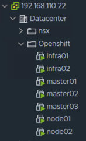

**In NCP version 2.5 and OpenShift integration we change the way the installation works. in the OpenShift host file we are not providing NSX configuration**

In The SDN section we specify that we are Not Installaing OpenShift SDN and Not Installiong NSX SDN

**openshift_use_openshift_sdn=false**  
**openshift_use_nsx=false**

Here is my complite OpenShift Host file:

<pre><code>
[OSEv3:children]
masters
nodes
etcd

[OSEv3:vars]
ansible_ssh_user=root
openshift_deployment_type=origin

openshift_master_identity_providers=[{'name': 'htpasswd_auth', 'login': 'true', 'challenge': 'true', 'kind': 'HTPasswdPasswordIdentityProvider'}]
openshift_master_htpasswd_users={'demo':'$apr1$Y.qago1d$kq387DpWGC.NrbCyLG8xf.'}
openshift_disable_check=package_version,memory_availability,disk_availability,docker_storage,docker_image_availability
openshift_cluster_monitoring_operator_install=false
openshift_logging_install_logging=false
openshift_web_console_install=false

openshift_master_default_subdomain=demo.lab.local
openshift_use_nsx=false
os_sdn_network_plugin_name=cni
openshift_use_openshift_sdn=false
openshift_node_sdn_mtu=1500
openshift_master_cluster_method=native
openshift_master_cluster_hostname=master01.lab.local
openshift_master_cluster_public_hostname=master01.lab.local

[masters]
master01.lab.local
master02.lab.local
master03.lab.local

[etcd]
master01.lab.local
master02.lab.local
master03.lab.local

[nodes]
master01.lab.local ansible_ssh_host=192.168.112.71 openshift_node_group_name='node-config-master'
master02.lab.local ansible_ssh_host=192.168.112.72 openshift_node_group_name='node-config-master'
master03.lab.local ansible_ssh_host=192.168.112.73 openshift_node_group_name='node-config-master'
infra01.lab.local ansible_ssh_host=192.168.112.74 openshift_node_group_name='node-config-infra'
infra02.lab.local ansible_ssh_host=192.168.112.75 openshift_node_group_name='node-config-infra'
node01.lab.local ansible_ssh_host=192.168.112.76 openshift_node_group_name='node-config-compute'
node02.lab.local ansible_ssh_host=192.168.112.77 openshift_node_group_name='node-config-compute'

</code></pre>  

Run on all node VMs:
<pre><code>
yum -y install wget git net-tools bind-utils yum-utils iptables-services bridge-utils bash-completion kexec-tools sos psacct
yum -y install https://dl.fedoraproject.org/pub/epel/epel-release-latest-7.noarch.rpm
sed -i -e "s/^enabled=1/enabled=0/" /etc/yum.repos.d/epel.repo
</code></pre>

Run on the master nodes:

<pre><code>
ssh-copy-id -i ~/.ssh/id_rsa.pub master01
ssh-copy-id -i ~/.ssh/id_rsa.pub master02
ssh-copy-id -i ~/.ssh/id_rsa.pub master03
ssh-copy-id -i ~/.ssh/id_rsa.pub node01
ssh-copy-id -i ~/.ssh/id_rsa.pub node02
ssh-copy-id -i ~/.ssh/id_rsa.pub infra01
ssh-copy-id -i ~/.ssh/id_rsa.pub infra02
 
yum -y --enablerepo=epel install ansible pyOpenSSL
git clone https://github.com/openshift/openshift-ansible
cd openshift-ansible/
git checkout release-3.11
cd
ansible-playbook -i hosts openshift-ansible/playbooks/prerequisites.yml
</code></pre>

Last step is to deploy the Openshift cluster:
<pre><code>
ansible-playbook -i hosts openshift-ansible/playbooks/deploy_cluster.yml
</code></pre>

<pre><code>
[root@master01 kubernetes-manifests]# oc get node
NAME                 STATUS    ROLES            AGE       VERSION
infra01.lab.local    Ready     compute,infra    6d        v1.11.0+d4cacc0
infra02.lab.local    Ready     compute,infra    6d        v1.11.0+d4cacc0
master01.lab.local   Ready     compute,master   6d        v1.11.0+d4cacc0
master02.lab.local   Ready     compute,master   6d        v1.11.0+d4cacc0
master03.lab.local   Ready     compute,master   6d        v1.11.0+d4cacc0
node01.lab.local     Ready     compute          6d        v1.11.0+d4cacc0
node02.lab.local     Ready     compute          6d        v1.11.0+d4cacc0
</code></pre>

When the deploy cluster ansible script finish there is no function SDN in the cluster.  
We need to deploy the ncp-openshift.yaml

The original unmodified ncp-openshift can be found here:
https://github.com/roie9876/NSXT-VMworld2019/blob/master/Part%205/ncp-openshift.yaml

# NSX Container Plugin Installation
[Back to Table of Contents](#Table-Of-Contents)

NSX Container Plugin (NCP) image file need to be copy to all masters and workers.  

## Load The Docker Image for NSX NCP on all masters and workers:

For the commands below, "sudo" can be used with each command or privilege can be escalated to root by using "sudo -H bash" in advance.

_**NSX Container Plugin (NCP) and NSX Node Agent Pods use the same container image.**_

## Install NCP image on all masters and Workers 

CNI is a Cloud Native Computing Foundation (CNCF) project. It is a set of specifications and libraries to configure network interfaces in Linux containers. It has a pluggable architecture hence third party plugins are supported.

NSX-T CNI Plugin comes within the "NSX-T Container" package. The package can be downloaded (in _.zip_ format) from Downloads page for NSX-T, shown below.

In the current NSX-T version (2.5.0) , the zip file is named as "**nsx-container-2.5.0.14628220**" . 

* Extract the zip file to a folder.

Use the NCP image for RHEL:  
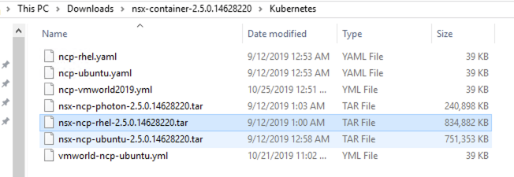

Once the above playbook finish do the following on all nodes:
<pre><code>
docker load -i nsx-ncp-rhel-2.5.0.14628220.tar
# Get the image name 
docker images
docker image tag registry.local/nsx-ncp-rhel-2.5.0.14628220.tar nsx-ncp
</code></pre>

##  (NCP) Configuration 

The file, "ncp-opensift.yml" will be used to deploy NSX Container Plugin. Node-Agent, Kube-Proxy , OVS and other related NCP configurations. 
However, before moving forward, NSX-T specific environmental parameters need to be configured. The yml file contains a configmap for the configuration of the ncp.ini file for the NCP.  Basically most of the parameters are commented out with a "#" character. The definitions of each parameter are in the yml file itself. 

The "ncp-opensift.yml" file can simply be edited with a text editor. The parameters in the file that are used in this environment has "#" removed. Below is a list and explanation of each :

staring with NCP 2.5 we can work with the policy API. with Policy API we need to defined the UUIDs of the objects.
#### Note: The UUIDs of the policy API are differences then the UUIDs of the manager API.

### how we can find the Policy UUID ? 
With the Chrome browser, we need to use the  Developer Tools:  
 

Click on the Ctrl + R to start record:  

  

We can clear the screen by the small icon   
for example lets find the UUID of the K8s-LB-Pool: 
We need to click on the NSX-T object that we would like to find his UUID:  

There is a small blue circle refresh button:   , Click on it. New date will show up. as you can see in the image bellow  
the **"id" : "k8s-LB-Poo"** this is the object UUID.  
  
    
    

let's start to explain the different parameters:

**[nsx_v3]**

**policy_nsxapi = True** : Specify that NCP will work with the Policy API.  

**single_tier_topology = True** : configure single tier1 per K8s/OpenShift Cluster. starting with NCP 2.5 we have two options for the tier1. we can manually create this tier1 and specify his name in the ncp config file, or we can let ncp automatically create this tier1. in this demo we want NCP to create this tier1 gateway. the name of tier1 taken from the **cluster =** parameters, in our demo its k8scluster.

**cluster = k8scluster** : Used to identify the NSX-T objects that are provisioned for this K8S cluster. Notice that K8S Node logical ports in "K8s-Contaainers" are configured with the "k8scluster" tag and the "ncp/cluster" scope also with the hostname of Ubuntu node as the tag and "ncp/node_name" scope on NSX-T side.

**enable_snat = True** : This parameter basically defines that all the K8S Pods in each K8S namespace in this K8S cluster will be SNATed (to be able to access the other resources in the datacenter external to NSX domain) . The SNAT rules will be autoatically provisioned on Tier 0 Router in this lab. The SNAT IP will be allocated from IP Pool named "K8S-NAT-Pool" that was configured back in Part 3.

**apiserver_host_port = 6443** : These parameters are for NCP to access K8S API. **Note this parnter need to configured multiple times in this yaml file, so every time you this parmter you need to configure the same value**
  
**apiserver_host_ip = 192.168.113.2**  
This is the IP address of the master node, if we have clusters of k8s masters we need to use the LB VIP.  
**Note this paramter need to configured multiple times in this yaml file, so every time you this parmter you need to configure the same value**

**ingress_mode = nat** : This parameter basically defines that NSX will use SNAT/DNAT rules for K8S ingress (L7 HTTPS/HTTP load balancing) to access the K8S service at the backend.

**nsx_api_managers = 192.168.110.34,192.168.110.35,192.168.110.36** , **nsx_api_user = admin** ,  **nsx_api_password = VMware1!VMware1!**  : These parameters are for NCP to access/consume the NSX Manager. in my lab i have 3 NSX managers, we need to provide the IPs of all managers (not the VIP of the managers). we can work with static username and passowrd (clear text) or we can work with certificate. in this demo i'm working with username and password.

**insecure = True** : NSX Manager server certificate is not verified. in lab enviroment where the NSX manager is self sigeded its better to use this way.

**ttier0_gateway = tier0** : The UUID of the Logical Gateway that will be used for connection top the phisical router (tier0).

**overlay_tz = a8811e7a-4d09-4076-94b3-7a9082750c64** : The UUID of the existing overlay transport zone that will be used for creating new logical switches/segments for K8S namespaces and container networking.

**subnet_prefix = 24** : The size of the IP Pools for the namespaces that will be carved out from the main "K8S-POD-IP-BLOCK" configured in Part 3 (10.19.0.0 /16). Whenever a new K8S namespace is created a /24 IP pool will be allocated from thatthat IP block.

**use_native_loadbalancer = True** : This setting is to use NSX-T load balancer for K8S Service Type : Load Balancer. Whenever a new K8S service is exposed with the Type : Load Balancer then a VIP will be provisioned on NSX-T LB attached to a Tier 1 Logical Router dedicated for LB function. The VIP will be allocated from the IP Pool named "K8S-LB-Pool" that was configured back in Part 3.

**default_ingress_class_nsx = True** : This is to use NSX-T load balancer for K8S ingress (L7 HTTP/HTTPS load balancing) , instead of other solutions such as NGINX, HAProxy etc. Whenever a K8S ingress object is created, a Layer 7 rule will be configured on the NSX-T load balancer.

**service_size = 'SMALL'** : This setting configures a small sized NSX-T Load Balancer for the K8S cluster. Options are Small/Medium/Large. This is the Load Balancer instance which is attached to a dedicated Tier 1 Logical Router in the topology.

**container_ip_blocks = K8S-POD-IP-BLOCK** : This setting defines from which IP block each K8S namespace will carve its IP Pool/IP address space from. (172.25.0.0 /16 in this case) Size of each K8S namespace pool was defined with subnet_prefix parameter above)

**external_ip_pools = K8S-NAT-Pool** : This setting defines from which IP pool each SNAT IP will be allocated from. Whenever a new K8S namespace is created, then a NAT IP will be allocated from this pool. (10.190.7.100 to 10.190.7.150 in this case)

**external_ip_pools_lb = K8S-LB-Pool** : This setting defines from which IP pool each K8S service, which is configured with Type : Load Balancer, will allocate its IP from. (10.190.6.100 to 10.190.6.150 in this case)

**top_firewall_section_marker = Section1** and **bottom_firewall_section_marker = Section2** : This is to specify between which sections the K8S orchestrated firewall rules will fall in between. 

I modified this file to make it works according to my environment:
https://github.com/roie9876/NSXT-VMworld2019/blob/master/Part%205/ncp-openshift-VMworkd2019.yml

<pre><code>
oc create -f ncp-opensift-VMworkd2019.yml
</code></pre>

The namespaces that are provisioned by default can be seen using the following kubectl command.
<pre><code>
[root@master01 home]# oc get ns
NAME                STATUS    AGE
default             Active    6d
kube-public         Active    6d
kube-system         Active    6d
management-infra    Active    6d
nsx-system          Active    5d
openshift           Active    6d
openshift-infra     Active    6d
openshift-logging   Active    6d
openshift-node      Active    6d
</code></pre>

<pre><code>
[root@master01 home]# oc get pod -n nsx-system
NAME                       READY     STATUS    RESTARTS   AGE
nsx-ncp-6857f8cd4c-ps96g   1/1       Running   0          51s
nsx-ncp-bootstrap-7qssw    1/1       Running   0          5d
nsx-ncp-bootstrap-967v2    1/1       Running   0          5d
nsx-ncp-bootstrap-98gxf    1/1       Running   0          5d
nsx-ncp-bootstrap-9zppw    1/1       Running   0          5d
nsx-ncp-bootstrap-c9ph8    1/1       Running   0          5d
nsx-ncp-bootstrap-lvs7l    1/1       Running   0          5d
nsx-ncp-bootstrap-rrtzf    1/1       Running   1          5d
nsx-node-agent-22zms       3/3       Running   2          5d
nsx-node-agent-5tznp       3/3       Running   3          5d
nsx-node-agent-fbwtj       3/3       Running   0          5d
nsx-node-agent-g9j7n       3/3       Running   0          5d
nsx-node-agent-qgnb9       3/3       Running   0          5d
nsx-node-agent-srr27       3/3       Running   0          5d
nsx-node-agent-w9rkc       3/3       Running   0          5d

</code></pre>

**Notice the changes to the existing logical switches/segments, Tier 1 Logical Routers, Load Balancer below . All these newly created objects have been provisioned by NCP (as soon as NCP Pod has been successfully deployed) by identifying the  the K8S desired state and mapping the K8S resources in etcd to the NSX-T Logical Networking constructs.**

We can view the tier1 gateway created by NCP:  
<<<<<<< HEAD
=======

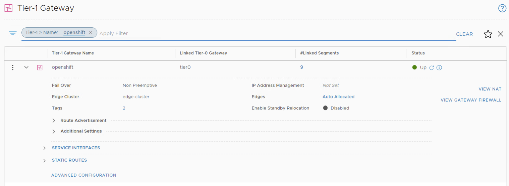
>>>>>>> 8fb6b07eaa2157403c326b3e2ace97af956ff7f2

<<<<<<< HEAD

This tieer1 have 9 Seegments, each segemnt its equal to OpenShift project:  
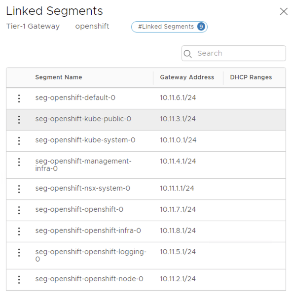
=======
This tieer1 have 9 Seegments, each segemnt its equal to OpenShift project:  

>>>>>>> 8fb6b07eaa2157403c326b3e2ace97af956ff7f2

For each OpenShift project we have NAT etry created on the tier1 Gateway:

<<<<<<< HEAD
For each OpenShift project we have NAT etry created on the tier1 Gateway:

NCP automaticly created Load Balancer with two VIPs:
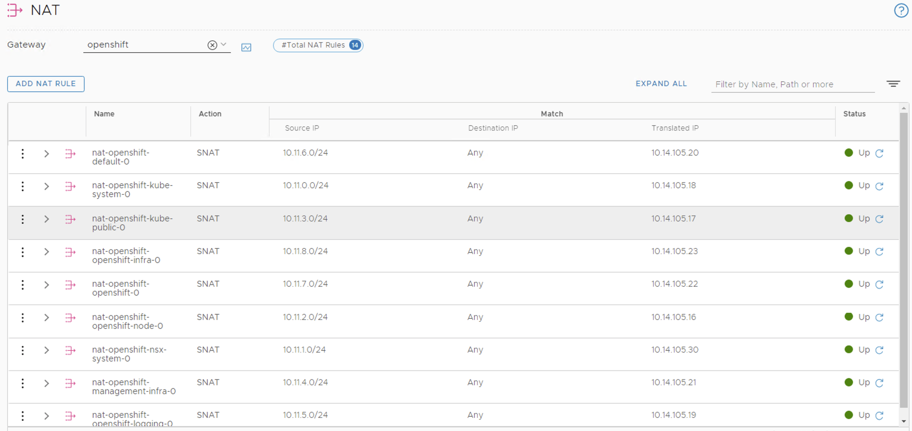

=======

NCP automaticly created Load Balancer with two VIPs:

>>>>>>> 8fb6b07eaa2157403c326b3e2ace97af956ff7f2
In The Virtual Server (VIP) we have two L7 etnry:
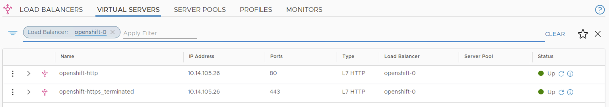

# Deploy the acme application
Thie application contains a Polyglot demo application comprised of (presently) 6 microservices and 4 datastores:  

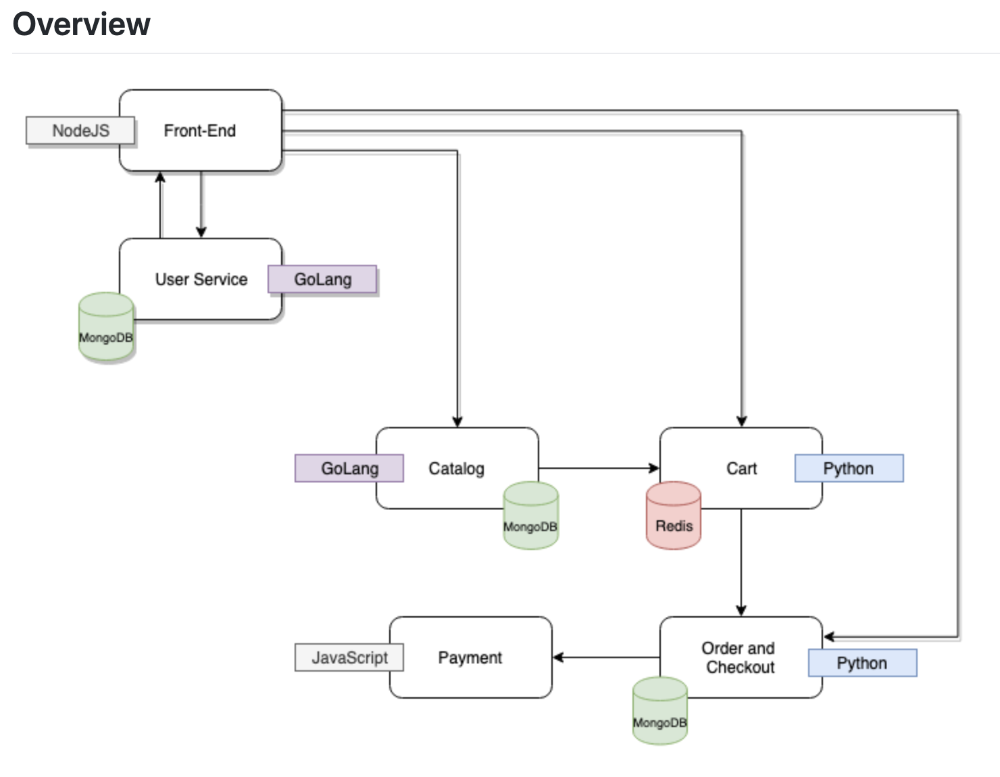

The contents here are the necessary YAML files to deploy the ACMEFIT application in a OpenShift cluster.

This app is developed by team behind www.cloudjourney.io  
The linke to forked app:

https://github.com/roie9876/acme_fitness_demo

<pre><code>
git clone https://github.com/roie9876/acme_fitness_demo
</code></pre> 

<<<<<<< HEAD
=======
create acme  project, we can work with NAT namespace or No-NAT. 
lets create it with NAT (this is the default). 

<pre><code>
[root@master01 home]# oc new-project acme
Already on project "acme" on server "https://master01.lab.local:8443".

You can add applications to this project with the 'new-app' command. For example, try:

    oc new-app centos/ruby-25-centos7~https://github.com/sclorg/ruby-ex.git

to build a new example application in Ruby.

</code></pre> 

We can see the results of the new project in NSX Segments, we have new Segment with the name: seg-openshift-acme-0.  
In the PORTS we have 0 Connected PODs (we didn't deploy any PODs yet...)

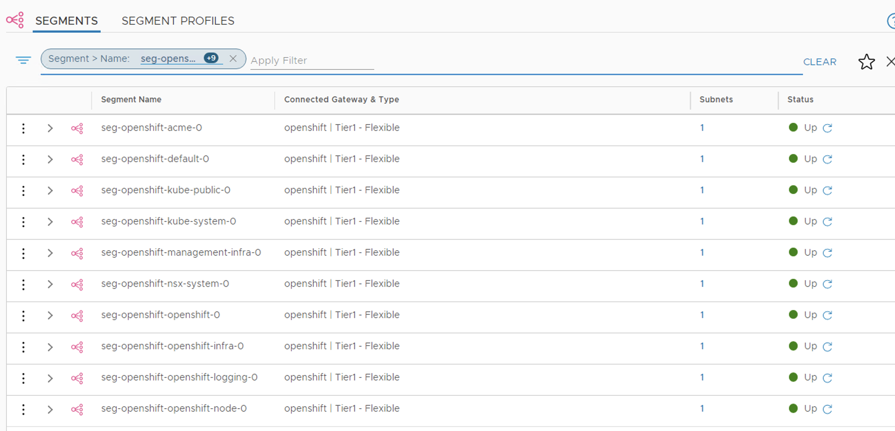

NSXT curve new CIDR 10.11.10.0/24 where the 10.11.10.1 is the default Gateway for this namespce 
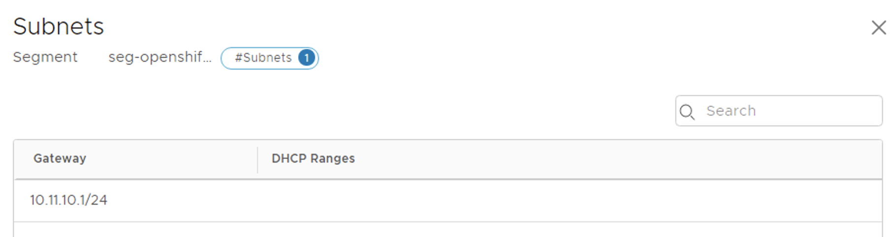

We can chekc if we have NCP create NAT rule for this namespace:  
As you can see there is no any ANT entry for 10.19.2.0/42

>>>>>>> 8fb6b07eaa2157403c326b3e2ace97af956ff7f2

# Deploy the acme application:  
<pre><code>
[root@master01 home]# oc create -f acme_fitness_demo/kubernetes-manifests/acme_fitness.yaml
secret/redis-pass created
secret/catalog-mongo-pass created
secret/order-mongo-pass created
secret/users-mongo-pass created
service/cart-redis created
deployment.apps/cart-redis created
service/cart created
deployment.apps/cart created
configmap/catalog-initdb-config created
service/catalog-mongo created
deployment.apps/catalog-mongo created
service/catalog created
deployment.apps/catalog created
deployment.apps/frontend created
service/order-mongo created
deployment.apps/order-mongo created
service/order created
deployment.apps/order created
service/payment created
deployment.apps/payment created
configmap/users-initdb-config created
service/users-mongo created
deployment.apps/users-mongo created
service/users created
deployment.apps/users created
<<<<<<< HEAD
</code></pre>
=======

 </code></pre>    
>>>>>>> 8fb6b07eaa2157403c326b3e2ace97af956ff7f2

Check The status of the PODs

<pre><code>
[root@master01 home]# oc get pod -o wide
NAME                             READY     STATUS    RESTARTS   AGE       IP            NODE                 NOMINATED NODE
cart-74868657bd-f58fx            1/1       Running   0          23s       10.11.10.2    infra01.lab.local    <none>
cart-redis-8548895c64-5j4db      1/1       Running   0          23s       10.11.10.3    node01.lab.local     <none>
catalog-5d86b4447d-q88qq         1/1       Running   0          22s       10.11.10.4    infra01.lab.local    <none>
catalog-mongo-5f7f9b97cb-v6m69   1/1       Running   0          22s       10.11.10.7    infra01.lab.local    <none>
frontend-76b454779c-scg8k        1/1       Running   0          22s       10.11.10.5    node02.lab.local     <none>
order-f59554484-q7cjw            1/1       Running   0          22s       10.11.10.6    node02.lab.local     <none>
order-mongo-84d55494dd-7b5ft     1/1       Running   0          22s       10.11.10.8    infra02.lab.local    <none>
payment-77d6776ddc-2s9lq         1/1       Running   0          22s       10.11.10.9    node01.lab.local     <none>
users-d5856777d-9f4ng            1/1       Running   0          21s       10.11.10.11   node01.lab.local     <none>
users-mongo-647bd448b-qkqsp      1/1       Running   0          21s       10.11.10.10   master01.lab.local   <none>

<<<<<<< HEAD
=======
  
>>>>>>> 8fb6b07eaa2157403c326b3e2ace97af956ff7f2
</code></pre>   
As you can see, all the PODs get IPs from range 10.11.10.0/24

We can see the reflections of the PODs in NSXT
<<<<<<< HEAD
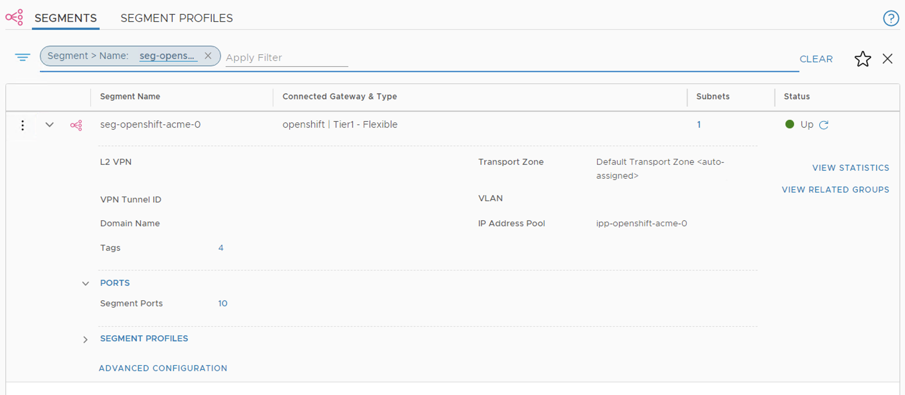 

Now we have 10 PORTs connected to this segments
we can see the PODs name from NSX UI:  
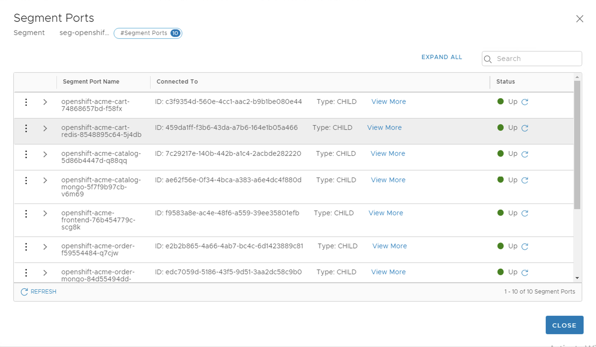

We can see all the OpenShift tags from the NSX UI:  
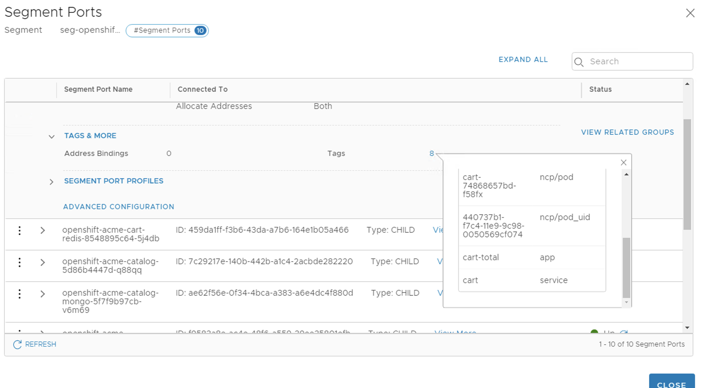
=======
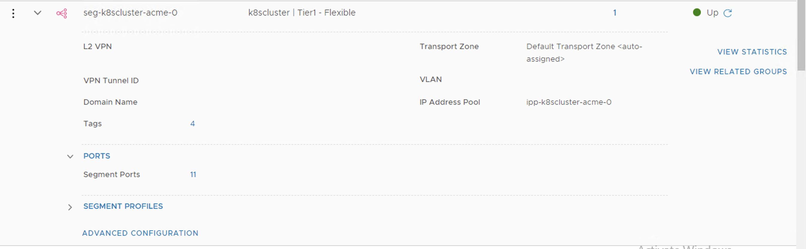

Now we have 10 PORTs connected to this segments
we can see the PODs name from NSX UI:  
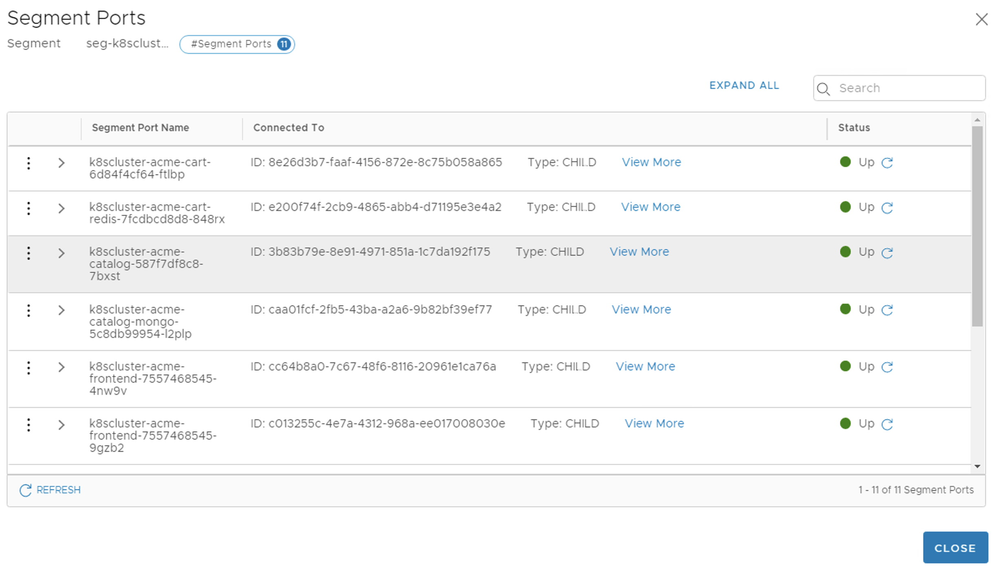

We can see all the K8s tags from the NSX UI:  
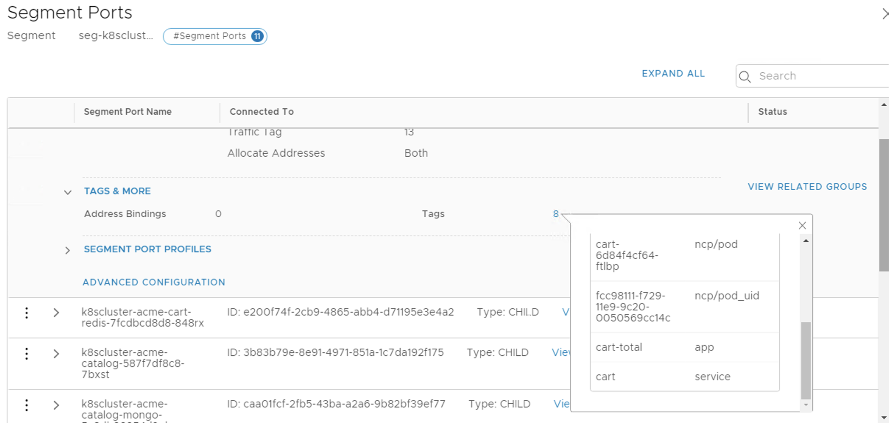
>>>>>>> 8fb6b07eaa2157403c326b3e2ace97af956ff7f2

# L4 Load Balancer
Create new L4 Service Type LB with persistence IP
<pre><code>
[root@master01 kubernetes-manifests]# cat frontend-svc.yaml
apiVersion: v1
kind: Service
metadata:
  labels:
    app: frontend-total
    service: frontend
  name: frontend
  namespace: acme
spec:
  ports:
  - name: http-frontend
#    nodePort: 30807
    port: 3000
    protocol: TCP
    targetPort: 3000
  selector:
    app: frontend-total
    service: frontend
  type: LoadBalancer
  loadBalancerIP: 10.14.100.100
</code></pre>  

We expting the VIP IP address will be 10.14.100.100
<pre><code>
[root@master01 kubernetes-manifests]# oc create -f frontend-svc.yaml
service/frontend created

[root@master01 kubernetes-manifests]# oc get svc frontend
NAME       TYPE           CLUSTER-IP       EXTERNAL-IP     PORT(S)          AGE
frontend   LoadBalancer   172.30.232.167   10.14.100.100   3000:31435/TCP   18s

</code></pre>   

The as you can see the svc of the frontend has 10.14.100.100 with port 3000 as L4 entry.
We can see the results of the new LB VIP in NSX UI:

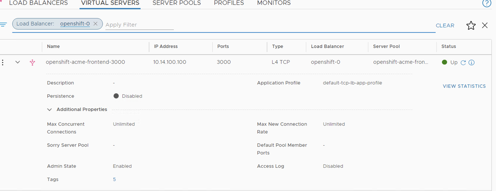

We can see the server pool member from NSX UI:
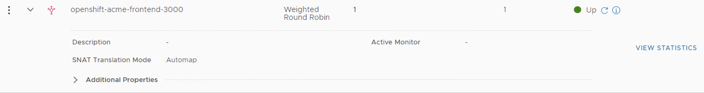

we can see we have only one member:  
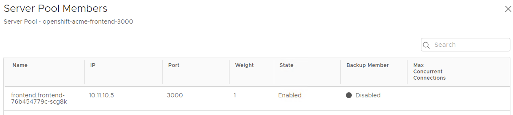

Scale more frontend PODs to the acme app:

<pre><code>
root@master01 kubernetes-manifests]# oc scale --replicas=2 deployment frontend
deployment.extensions/frontend scaled
</code></pre>   

We can see that we now have 2 endpoint in the service pool: 
<pre><code>  
[root@master01 kubernetes-manifests]# oc describe svc frontend
Name:                     frontend
Namespace:                acme
Labels:                   app=frontend-total
                          service=frontend
Annotations:              ncp/internal_ip_for_policy=100.64.128.1
Selector:                 app=frontend-total,service=frontend
Type:                     LoadBalancer
IP:                       172.30.232.167
IP:                       10.14.100.100
LoadBalancer Ingress:     10.14.100.100
Port:                     http-frontend  3000/TCP
TargetPort:               3000/TCP
NodePort:                 http-frontend  31435/TCP
Endpoints:                10.11.10.12:3000,10.11.10.5:3000
Session Affinity:         None
External Traffic Policy:  Cluster
Events:                   <none>

</code></pre> 

From NSX UI we can see we have new member in the server pool:
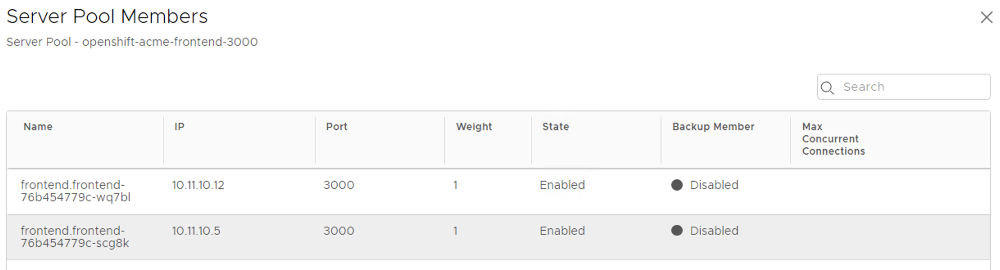

Test the acme application with the broswer:

# L7 Ingress
We can create L7 ingress for the frontend service:  

<pre><code>
[root@master01 kubernetes-manifests]# cat ingress.yaml
apiVersion: extensions/v1beta1
kind: Ingress
metadata:
  name: frontend
spec:
  rules:
  - host: frontend.lab.local
    http:
      paths:
      - path: /*
        backend:
          serviceName: frontend
          servicePort: 3000

root > kubectl create -f ingress.yaml
ingress.extensions/frontend created
[root@master01 kubernetes-manifests]# oc create -f ingress.yaml
ingress.extensions/frontend created
[root@master01 kubernetes-manifests]# oc describe ingress frontend
Name:             frontend
Namespace:        acme
Address:
Default backend:  default-http-backend:80 (<none>)
Rules:
  Host                Path  Backends
  ----                ----  --------
  frontend.lab.local
                      /*   frontend:3000 (<none>)
Annotations:
Events:  <none>
</code></pre> 

In the NSX-T LB we can can see the L7 rule:  
The rule created in the **Request Forwarding Phase**

We can view the re-write rule from the UI:  

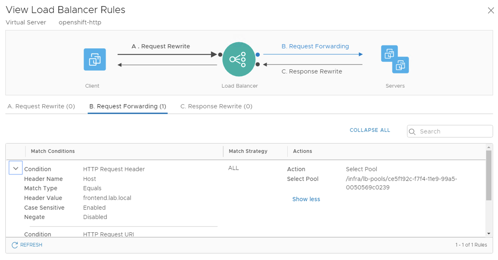
The user sends traffic to URL: frontend.lab.local which hit the L7 Ingress in NSX LB. Then the NSX LB re-write this request and sends it to the K8s frontend pool.

Open the browser to http://frontend.lab.local:  

